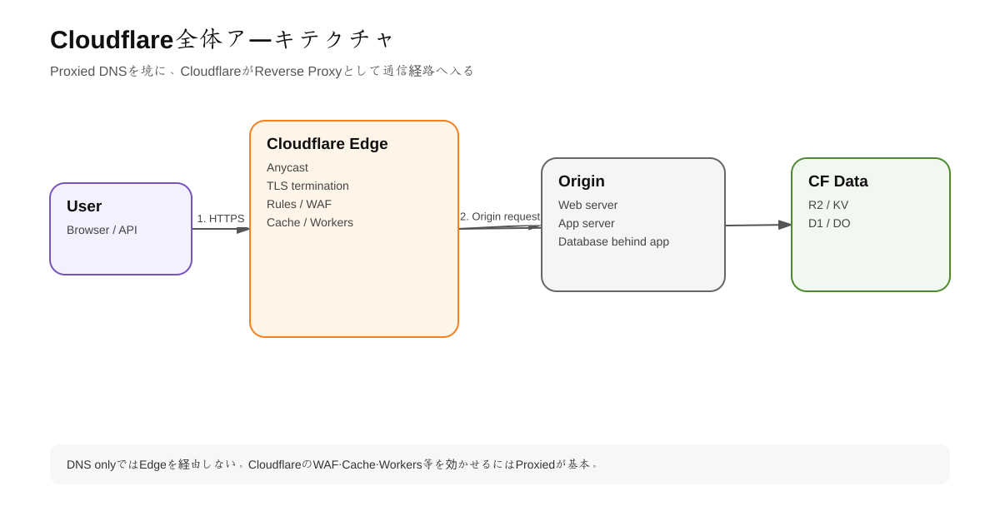
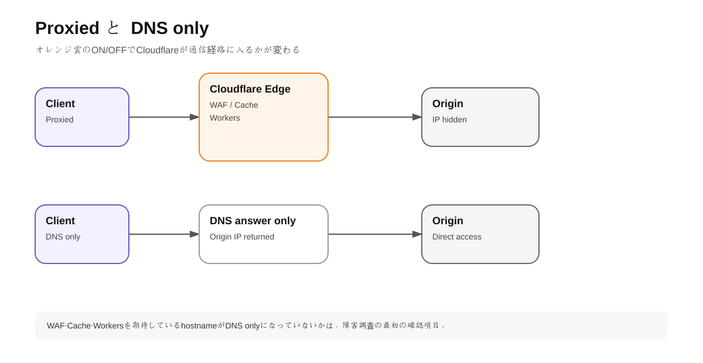
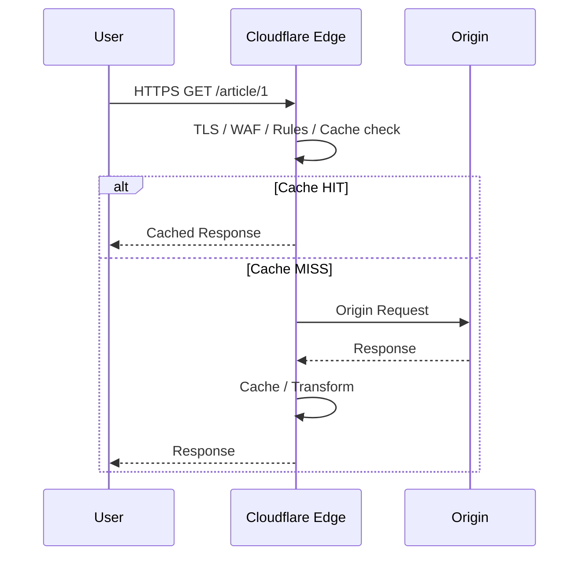

# 第1章 Cloudflareの全体アーキテクチャ

## 1. 学習目標

この章の目的は「Cloudflareを入れると何が起きるのか」を通信単位で説明できるようになること。

最終的に次の質問へ答えられる状態を目指す。

- Cloudflare DNSとCDNは何が違うか
- オレンジ雲（Proxied）とグレー雲（DNS only）は何が違うか
- Origin IPが隠れるとはどういう意味か
- Anycastは何を解決しているか
- CloudflareのEdgeで何が処理されるか
- キャッシュHITとMISSでOriginへの通信がどう変わるか
- WorkersはOriginの前なのか後なのか
- Rules/WAF/Cache Rulesの順序がなぜ重要か

---

## 2. Cloudflareは「通信経路の中間層」である

<!-- visual:start -->


> **図の要点:** Proxied DNSではCloudflare EdgeがReverse Proxyとして通信経路に入り、Security・Cache・Workersなどの処理点になる。
<!-- visual:end -->

典型的なWeb構成は次の通り。

```text
User -> DNS -> Web Server
```

Cloudflareのプロキシを有効にすると、HTTP/HTTPS通信は概念的に次の形になる。

```text
User -> Cloudflare DNS -> Cloudflare Edge -> Origin Server
```

Cloudflare Edgeは単なる中継ではない。ここで次のような処理を実行できる。

- TLS終端
- DDoS緩和
- WAF
- Bot判定
- Rate Limiting
- Redirect / Rewrite / Header変換
- Access認証
- CDNキャッシュ
- Workersコード実行
- 画像変換
- Origin選択
- ログ・分析

つまりCloudflareを理解するということは、**Originに届く前のプログラマブルな制御層を理解すること**に近い。

---

## 3. 権威DNSとしてのCloudflare

<!-- visual:start -->


> **図の要点:** DNSレコードが存在するだけではCloudflareの保護機能は働かない。ProxiedかDNS onlyかで、通信経路そのものが変わる。
<!-- visual:end -->

通常のFull setupでは、ドメインのレジストラに登録しているネームサーバーをCloudflare指定のネームサーバーへ変更する。これによりCloudflareがそのゾーンのPrimary Authoritative DNSになる。

たとえばCloudflare上に次のレコードがあるとする。

```text
A  example.com  203.0.113.10  Proxied
```

DNS問い合わせに対してCloudflareは原則として `203.0.113.10` をそのまま返すのではなく、CloudflareのAnycast IPを返す。

そのためブラウザはOriginへ直接接続せずCloudflareへ接続する。

### DNS onlyの場合

```text
A  db.example.com  203.0.113.20  DNS only
```

この場合、DNSはCloudflareが回答しても接続先としてOriginのIPを返す。HTTP通信はCloudflareプロキシを通らない。

### 実務上の意味

**DNSをCloudflareで管理している = 全通信がCloudflare経由**ではない。

レコード単位でProxied/DNS onlyが決まるため、セキュリティレビューではDNSレコード一覧を確認し、意図せずOriginを露出していないか見る必要がある。

---

## 4. Anycastの役割

CloudflareのプロキシIPは世界中の複数拠点からBGPで広告される。同じIPアドレスに対する通信でも、インターネットのルーティングにより到達しやすいCloudflare拠点へ運ばれる。

重要なのは「必ず地理的に最短のデータセンターへ行く」という単純な説明ではなく、**ネットワーク上の経路選択によって近いCloudflareロケーションへ収束する**という点。

Anycastによって得られる主な効果は次の通り。

- エンドユーザーからEdgeまでの遅延を抑えやすい
- 単一IPへ大規模トラフィックが来てもネットワーク全体へ分散できる
- DDoSを特定の単一拠点で受け止める構成になりにくい
- 同じアプリケーションを世界中のEdgeから提供できる

---

## 5. Reverse ProxyとしてのCloudflare

リバースプロキシはユーザーとOriginの間に入り、Originの代わりに接続を受ける。



### 重要: TLS接続は2区間

Cloudflareを使うHTTPSは概念的に2本のTLS接続を持つ。

1. Visitor ↔ Cloudflare
2. Cloudflare ↔ Origin

したがってブラウザでHTTPSになっているだけでは、CloudflareからOriginまで暗号化・検証されているとは限らない。第2章で `Full (strict)` を扱う。

---

## 6. Origin IPを隠すとは何か

Proxiedレコードでは通常、公開DNSからCloudflare IPが返るためOrigin IPを直接知りにくくなる。

ただし「Cloudflareを有効化したからOrigin IPは完全に秘密」と考えてはいけない。

Origin IPが漏れる代表例:

- 過去のDNS履歴
- 別サブドメインのDNS onlyレコード
- メールサーバーとWebサーバーのIP共用
- Git、設定ファイル、エラーメッセージへの記載
- Originが直接応答する別ドメイン
- 外部スキャンでの推測

本当にCloudflareをバイパスさせたくない場合は次のいずれかを設計する。

- Cloudflare TunnelでPublic IP自体を不要にする
- Origin FWでCloudflareの送信元IPレンジのみ許可する
- Authenticated Origin PullsでCloudflareからのmTLSを要求する
- 上記を環境に応じて併用する

---

## 7. Cloudflare Edgeでの処理順序

CloudflareのRuleset Engineではリクエスト処理が「phase」に分かれる。代表的な順序は概念的に次の通り。

```text
Single Redirects
↓
URL Rewrite
↓
Configuration Rules
↓
Origin Rules
↓
L7 DDoS
↓
WAF Custom Rules
↓
Rate Limiting
↓
WAF Managed Rules
↓
Super Bot Fight Mode
↓
Cloudflare Access check
↓
Bulk Redirects
↓
Request Header Transform
↓
Cache Rules
↓
Snippets
↓
Origin / Worker / other processing
```

正確な全phaseは公式のPhases listを参照する。

### なぜ順序が重要か

例として、URL Rewriteで `/old/123` を `/new/123` に書き換えた場合、後続phaseでは書き換え後のURIを参照できる。一方、**同一phase内の別ルールが、直前のルールで変更した値をそのまま読めるとは限らない**。

この特性を理解しないと、

- WAFが想定外のURLに適用される
- Redirectが先に終了して後続ルールが動かない
- Cache Ruleが思った条件にマッチしない

といった事故が起きる。

---

## 8. Cloudflareの「4層モデル」で整理する

製品名ではなく以下の4層に分類すると設計しやすい。

### Layer A: Network / Delivery

- Authoritative DNS
- Anycast
- CDN
- Argo Smart Routing
- Load Balancing

目的: 到達性、高速化、可用性。

### Layer B: Security / Identity

- DDoS Protection
- WAF
- Rate Limiting
- Bot Management
- Turnstile
- Cloudflare Access
- Gateway

目的: 不正通信や不正ユーザーをOriginより前で止める。

### Layer C: Compute / Rules

- Ruleset Engine
- Workers
- Snippets
- Workflows

目的: 通信やアプリロジックをEdgeで制御する。

### Layer D: Data / Storage

- KV
- R2
- D1
- Durable Objects
- Queues
- Hyperdrive

目的: アプリケーション状態、オブジェクト、DB、非同期処理を管理する。

---

## 9. 実務で何が変わるか

### 従来

```text
DNS provider
+ CDN provider
+ WAF appliance/service
+ VPN
+ App server
+ Object storage
+ DB
+ Monitoring
```

### Cloudflare中心設計

```text
Cloudflare DNS/Proxy
  ├ Security
  ├ Cache
  ├ Zero Trust
  ├ Workers
  ├ Storage/Data
  └ Observability
      ↓
Origin / external cloud
```

統合のメリットは「サービス数が減ること」だけではない。**同じEdgeで共通のリクエスト属性を使い、セキュリティ・ルーティング・キャッシュ・アプリコードを連携できる**点が大きい。

一方でCloudflare依存が深くなるため、ロックイン、障害ドメイン、料金体系、移行可能性も設計対象になる。

---

# ハンズオン1: 自分のドメインの通信経路を観察する

## 手順1 DNSを見る

```bash
dig example.com A
```

確認点:

- ANSWERのIPはOriginかCloudflare IPか
- ProxiedをOFFにした時にどう変わるか

## 手順2 HTTPレスポンスヘッダーを見る

```bash
curl -I https://example.com/
```

Cloudflare経由の場合、構成によって次のようなCloudflare関連ヘッダーを確認できる。

```text
server: cloudflare
cf-ray: ...
cf-cache-status: HIT | MISS | DYNAMIC | BYPASS ...
```

`CF-Ray` はリクエスト調査で非常に重要な識別子になる。

## 手順3 DevToolsで確認

Chrome DevTools > Networkで次を観察する。

- TTFB
- `CF-Cache-Status`
- `Cache-Control`
- `Age`
- HTTP protocol
- Response size

---

## 10. この章で覚えるべき設計原則

1. **CloudflareはDNSとProxyを分けて考える。**
2. **Proxiedで初めてHTTPレイヤーのCloudflare機能が有効になる。**
3. **Originを隠すこととOriginを閉じることは別。**
4. **キャッシュHITならOriginへ行かない。**
5. **Ruleset Engineのphase順序を理解する。**
6. **Cloudflareを「前段の制御プレーン」として設計する。**

---

## 理解チェック

- なぜDNS onlyのAレコードではWAFが効かないのか。
- CloudflareでTLS証明書が有効なのにOrigin証明書が必要な理由は何か。
- Cache HIT時にOrigin障害の影響が小さくなるのはなぜか。
- Origin IPが漏れてもCloudflare迂回を防ぐ方法を3つ挙げられるか。
- Redirect RulesとWAFの順序が設計に影響する例を説明できるか。

---

## 公式ドキュメント

- How Cloudflare DNS works: https://developers.cloudflare.com/fundamentals/concepts/how-cloudflare-works/
- Cloudflare IP addresses / Anycast: https://developers.cloudflare.com/fundamentals/concepts/cloudflare-ip-addresses/
- Ruleset Engine phases: https://developers.cloudflare.com/ruleset-engine/about/phases/
- Phases list: https://developers.cloudflare.com/ruleset-engine/reference/phases-list/
