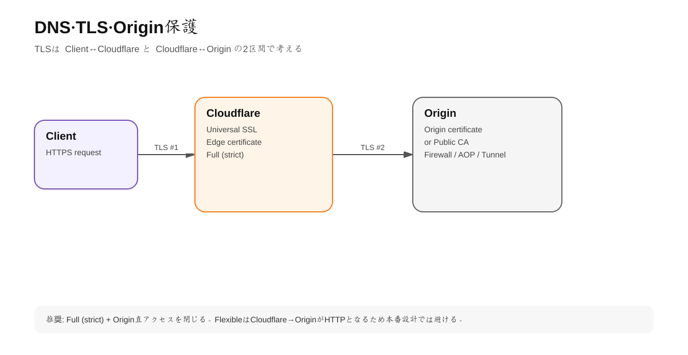
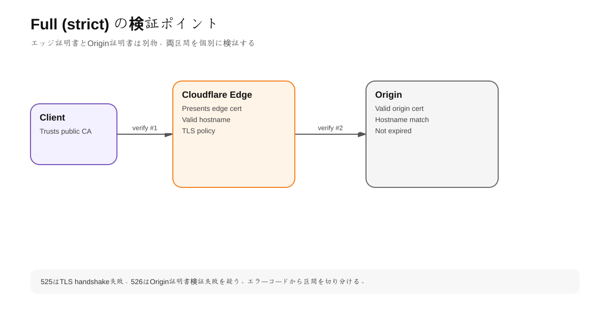

# 第2章 DNS・TLS・Origin保護

## 1. 学習目標

この章では「Cloudflareへドメインを載せる」作業を、単なるネームサーバー変更ではなくセキュアな移行として扱う。

到達目標:

- Full DNS setupの手順とリスクを説明できる
- Proxied/DNS onlyを適切に使い分けられる
- DNSSECを有効化できる
- SSL/TLS modeの違いを説明できる
- `Full (strict)` を標準として構成できる
- Origin CA / Public CAの選択ができる
- Originへの直接アクセスを制限できる

---

## 2. DNS移行前に棚卸しする

Cloudflareへネームサーバーを切り替える前に、現在のDNSゾーンを必ず棚卸しする。

最低限確認するレコード:

- A / AAAA
- CNAME
- MX
- TXT
- SPF
- DKIM
- DMARC
- CAA
- SRV
- サービス認証用TXT/CNAME

メール系レコードを誤ってProxy対象にしないこと。Cloudflareの通常HTTP ProxyはMXなどのメール配送を代理しない。

### 推奨移行フロー

```text
1. 現行DNSをexport/記録
2. Cloudflareへzone追加
3. 自動import結果と現行DNSを差分確認
4. Web用A/AAAA/CNAMEのProxy方針を決定
5. メール・検証系はDNS onlyを確認
6. TTLと切替計画を確認
7. registrarでnameserver変更
8. digでauthoritative NS確認
9. HTTP/HTTPS確認
10. DNSSECを適切な順序で有効化
```

---

## 3. Full setup

Free/Proで一般的なのはCloudflareをPrimary Authoritative DNSにするFull setup。

Cloudflareへzoneを追加すると、通常2つのCloudflare nameserverが割り当てられる。Registrar側でそのNSへ変更する。

```bash
dig NS example.com +short
```

変更後は、結果がCloudflare指定NSになっていることを確認する。

### 注意: DNSSEC移行

旧DNS事業者でDNSSECが有効な状態のまま、DSレコードと署名の整合を崩してnameserverだけ変更すると名前解決不能になることがある。

DNSSEC有効ドメインの移行は「旧側DNSSEC無効化→DS削除→移行→Cloudflare側DNSSEC有効化」の単純手順だけでなく、multi-signer等も存在する。本番ドメインでは現行構成に合わせて公式移行手順を使う。

---

## 4. ProxiedとDNS only

### Proxied

WebアクセスをCloudflare Edgeへ入れる。

適する例:

- `example.com`
- `www.example.com`
- `api.example.com`
- 公開Webアプリ

得られるもの:

- DDoS Protection
- WAF
- Cache
- Rules
- Cloudflare TLS
- Bot対策
- Analytics

### DNS only

CloudflareはDNS回答だけを行う。

適する例:

- MXの宛先ホスト
- 第三者SaaSのドメイン検証CNAME
- Cloudflare Proxy非対応プロトコルのホスト
- 意図的にCloudflareを通さないシステム

### セキュリティ設計上の注意

同じOrigin IPを次のように使うと、`origin.example.com` からOrigin IPが判明して `www` を迂回される可能性がある。

```text
www.example.com     -> 203.0.113.10 Proxied
origin.example.com  -> 203.0.113.10 DNS only
```

「Web用OriginをCloudflare経由に限定する」なら、Origin専用ネットワーク、Tunnel、FW制限などを設計する。

---

## 5. DNSSEC

DNSSECはDNS回答に暗号学的署名を付与し、リゾルバが改ざんを検知できる仕組み。

Cloudflareで有効化すると、Cloudflareがzoneを署名しDSレコード情報を生成する。RegistrarへDSを登録することで親zoneからchain of trustがつながる。

### ハンズオン

1. Cloudflare Dashboard > DNS > Settings > DNSSEC
2. Enable DNSSEC
3. 表示されたDS情報をRegistrarへ登録
4. 反映後に確認

```bash
dig example.com A +dnssec
```

より厳密にはDNSSEC validatorや `delv` 等も利用する。

### 事故ポイント

DSレコードがRegistrarに残ったまま署名側を変えるとSERVFAILの原因になる。nameserver移行時は特に注意する。

---

# 6. TLSの二重構造

<!-- visual:start -->


> **図の要点:** Client↔CloudflareとCloudflare↔Originは別々のTLS接続。証明書・暗号化モード・エラーを区間ごとに切り分ける。
<!-- visual:end -->

Cloudflare Proxy利用時のHTTPSは二つの区間に分かれる。

```text
Browser ==TLS A==> Cloudflare ==TLS B==> Origin
```

Browserが鍵アイコンを表示するのは主にTLS Aが成立しているからであり、TLS Bの安全性はCloudflare側のEncryption Modeに依存する。

---

## 7. Encryption Modes

<!-- visual:start -->


> **図の要点:** 本番ではFull (strict)を基準にし、Origin側の証明書有効性とhostname一致まで検証する。
<!-- visual:end -->

### Off

HTTPSを使わない。通常のWeb本番では選択しない。

### Flexible

Visitor→CloudflareはHTTPSでも、Cloudflare→OriginはHTTPになり得る。

問題:

- Origin区間が平文
- HTTPSリダイレクト設定と組み合わせるとloopしやすい

レガシー救済以外では原則避ける。

### Full

OriginへHTTPS接続するが、Origin証明書の妥当性を厳密に検証しない。期限切れ、self-signed、hostname不一致でも接続可能な場合がある。

### Full (strict)

OriginへHTTPS接続し、証明書を検証する。

**一般的な本番構成ではこれを標準にする。**

Origin証明書は次のいずれかを使える。

- Public CA（Let's Encrypt等）
- Cloudflare Origin CA

### Strict (SSL-Only Origin Pull)

Enterprise向け。VisitorがHTTPで来てもOriginへの接続をTLSに固定し、証明書検証を行う。

---

## 8. Universal SSLとOrigin Certificateを混同しない

### Universal SSL

Cloudflare EdgeがVisitorへ提示する証明書。

```text
Browser -> Cloudflare
```

### Origin Certificate

CloudflareからOriginへ接続する際にOriginが提示する証明書。

```text
Cloudflare -> Origin
```

Cloudflare Origin CA証明書はCloudflare↔Origin用途に向く。Originへブラウザで直接アクセスした場合、一般のブラウザTrust Storeでは信頼されないため警告になるのが通常。

この性質は「OriginはCloudflare越しに使う」という設計と相性がよい。

---

## 9. OriginをCloudflare経由に限定する方法

### 方法A: FirewallでCloudflare IPのみ許可

Originの80/443をCloudflareの公開IPレンジからのみ許可する。

メリット:

- 既存Origin構成を比較的維持できる

注意:

- Cloudflare IPレンジ更新への追従
- SSH等の管理経路は別設計
- LB/Health Checkなど必要通信も考慮

### 方法B: Authenticated Origin Pulls

Cloudflare→OriginのTLSでクライアント証明書を使い、OriginがCloudflareからの接続であることを検証するmTLS方式。

Global AOPのCloudflare提供証明書は「Cloudflare Networkから来たこと」を確認するがアカウント専用ではない。より厳密にはzone/hostname単位の独自certificateを検討する。

AOPはFull以上の暗号化モードで使う。

### 方法C: Cloudflare Tunnel

Origin側の `cloudflared` からCloudflareへoutbound-only connectionを張る。

```text
Internet
  ↓
Cloudflare
  ⇅ established tunnel
cloudflared
  ↓
localhost/private service
```

OriginにPublic inbound portを開ける必要がない。

AOPとTunnelは仕組みが異なり、TunnelではInbound listenerへCloudflareがclient certificateを提示する構造ではないためAOPは適用しない。

---

# ハンズオン2: Full (strict)構成を作る

## 前提

検証用サブドメイン `lab.example.com` とHTTPS Originを用意する。

## 手順

1. DNSで `lab` のA/CNAMEを作りProxiedにする
2. OriginにPublic CAまたはOrigin CA証明書を配置
3. Cloudflare > SSL/TLS > Overview
4. Encryption modeを `Full (strict)` にする
5. HTTPからHTTPSへRedirectする
6. `curl` で確認

```bash
curl -I http://lab.example.com
curl -I https://lab.example.com
```

期待値:

- HTTPはHTTPSへredirect
- HTTPSは200/3xx等、意図した結果
- 525/526が出ない

### 526の場合

Full (strict)でOrigin certificate検証に失敗している可能性が高い。

確認:

- Certificate expiry
- SAN/CN hostname
- Certificate chain
- SNI
- Originの443 listener

### 525の場合

Cloudflare-Origin間TLS handshake自体の失敗を疑う。

---

## 10. 推奨ベースライン

一般的なWebサイト/アプリなら以下を起点にする。

```text
DNS: Cloudflare Primary
Web records: Proxied
DNSSEC: Enabled
Visitor TLS: Universal SSL
Origin TLS: Valid certificate
Encryption Mode: Full (strict)
HTTP -> HTTPS: Redirect
Origin bypass: Firewall restriction or Tunnel
```

---

## 11. 業務メリット

### 運用

- DNS、TLS、Proxyを一元管理
- Certificate更新の手作業を減らせる
- Origin移行時のDNS/ルーティング制御を統一できる

### セキュリティ

- Origin IP露出を減らす
- WAF前段を迂回しにくくする
- Visitor-Origin間をend-to-endで暗号化できる

### UX

TLS終端をEdgeへ置くことでユーザーに近い地点で接続を確立しやすく、Cloudflare側のHTTP最適化と組み合わせられる。

---

## 12. よくある誤り

- Flexibleを「SSLがONだから安全」と判断する
- `Full` と `Full (strict)` の違いを無視する
- Cloudflare Origin CA証明書を一般公開Originへ直接見せる
- DNSSECのDSレコードを残したままNS移行する
- DNS onlyのサブドメインからOrigin IPを漏らす
- Cloudflare Proxyを有効にしただけでOrigin直アクセスも防げたと思う

---

## 理解チェック

- Universal SSLとOrigin CAの役割を図示できるか。
- FullとFull (strict)の違いは何か。
- Tunnel利用時にAOPを使わない理由を説明できるか。
- DNSSECでDSが壊れると何が起きるか。
- ProxiedとDNS onlyの判断基準を説明できるか。

---

## 公式ドキュメント

- Full setup: https://developers.cloudflare.com/dns/zone-setups/full-setup/setup/
- DNSSEC: https://developers.cloudflare.com/dns/dnssec/
- SSL/TLS encryption modes: https://developers.cloudflare.com/ssl/origin-configuration/ssl-modes/
- Full (strict): https://developers.cloudflare.com/ssl/origin-configuration/ssl-modes/full-strict/
- Authenticated Origin Pulls: https://developers.cloudflare.com/ssl/origin-configuration/authenticated-origin-pull/
- Cloudflare Tunnel: https://developers.cloudflare.com/cloudflare-one/networks/connectors/cloudflare-tunnel/

