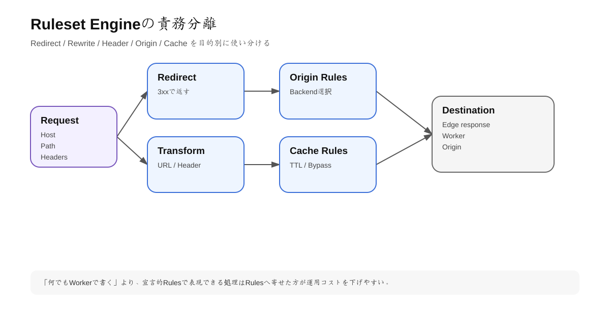
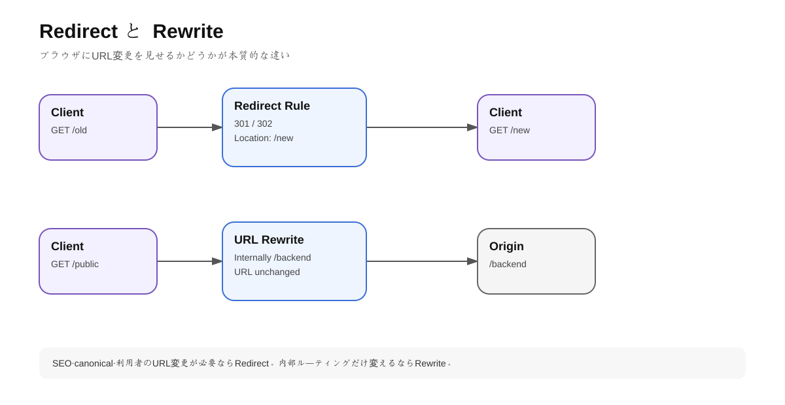

# 第5章 Ruleset Engineとトラフィック制御

## 1. 学習目標

Cloudflareを実務で使いこなすには、個別製品より先にRuleset Engineを理解した方がよい。

この章の到達目標:

- Rules / Rulesets / Phasesを説明できる
- Redirect / Rewrite / Origin / Configuration / Cacheの責務を分けられる
- ルール実行順の影響を説明できる
- Page Rulesから現行Rulesへ移行できる
- GUIだけでなくAPI/Terraformで管理する前提を持てる

---

## 2. Ruleset Engineとは

<!-- visual:start -->


> **図の要点:** Redirect・Transform・Origin・Cacheを目的別に分け、宣言的ルールで表現できる処理をWorkersへ過剰に寄せない。
<!-- visual:end -->

Ruleset EngineはCloudflare上の多くの「条件に一致した通信へ処理を適用する」機能の共通基盤。

基本構造は次の通り。

```text
Rule
  ├ Filter expression
  └ Action

Ruleset
  ├ Rule 1
  ├ Rule 2
  └ Rule 3

Phase
  └ Entry point ruleset
```

### Rule

例:

```text
IF host == www.example.com AND path starts_with /old/
THEN redirect to https://example.com/...
```

### Ruleset

同一phaseで実行されるordered rulesの集合。

### Phase

リクエスト処理の「どの段階で」そのRulesetが動くかを定義する。

---

## 3. ルールを製品名でなく「責務」で選ぶ

### Redirect Rules

ブラウザ/クライアントへ3xxを返し、別URLへ再アクセスさせる。

用途:

- HTTP→HTTPS
- `www`→apex
- 旧URL→新URL
- domain migration

### URL Rewrite Rules

ブラウザURLを変えず、Cloudflare内部でURI path/queryを変更する。

用途:

```text
/public/articles/123
↓ internal rewrite
/api/content?id=123
```

### Request Header Transform Rules

Originへ送るrequest headerを追加/削除/変更する。

### Response Header Transform Rules

Browserへ返すresponse headerを変更する。

用途:

- security headers
- debug header削除
- custom response metadata

### Origin Rules

「どのOriginへ、どう接続するか」を変更する。

可能なoverride例:

- Destination port
- Host header（プラン制約あり）
- SNI（プラン制約あり）
- DNS origin override（プラン制約あり）

### Configuration Rules

Cloudflare feature settingsを条件付きで変更する。

### Cache Rules

Cache eligibilityやTTL等を設定する。

---

## 4. RedirectとRewriteの違い

<!-- visual:start -->


> **図の要点:** 利用者のURLを変更するのがRedirect、内部の送信先だけ変更するのがRewrite。SEOやcanonical設計にも影響する。
<!-- visual:end -->

### Redirect

```text
GET /old
<- 301 Location: /new
GET /new
<- 200
```

Clientが2回requestする。

URL barも `/new` に変わる。

### Rewrite

```text
GET /old
Cloudflare internally rewrites to /new
<- 200
```

Clientからは `/old` のまま。

### 選択基準

| 要件 | 選ぶ |
|---|---|
| SEO上URLを統一 | Redirect |
| 旧URLを廃止 | Redirect |
| 内部routingだけ変更 | Rewrite |
| 外部へURLを見せたくない | Rewrite |

---

## 5. Ruleset Engineの重要な実行特性

### 同一phaseではfieldが途中更新されない場合がある

公式ドキュメントでは、同一phase内のrule evaluation中はrequest/response fieldsがimmutableとして評価される。

つまりURL Rewrite Rule 1がpathを変えても、同じURL Rewrite phaseのRule 2が必ずその変更後pathを条件式で見るわけではない。

後続phaseでは変更後のfieldが使われる。

### Raw fields

後続phaseでも元の値を使いたい場合は `raw.*` fieldを利用できる場合がある。

設計時は以下を明示する。

```text
Original URL
Normalized URL
Rewritten URL
Origin URL
```

---

## 6. Terminative action

Block、Redirect、Challenge等のterminating actionは、matchするとその場で処理を終了することがある。

例:

```text
Rule 1: /legacy/* -> Redirect
Rule 2: /legacy/admin/* -> Block
```

もしRedirect phaseがBlockのWAF phaseより先なら、WAFでそのoriginal pathをBlockする前にRedirect responseが返る可能性がある。

実際の設計では「最終的にどのphaseへ到達するか」を考える。

---

## 7. 2026年のPage Rulesの位置づけ

Page Rulesは長くCloudflare設定の中心だったが、新規実装ではmodern Rules productsが推奨されている。

主な対応:

| 旧Page Rule用途 | 現行 |
|---|---|
| Forwarding URL | Single Redirects |
| Cache Everything / TTL | Cache Rules |
| Host Header Override | Origin Rules |
| Resolve Override | Origin Rules |
| SSL setting | Configuration Rules |
| Browser Cache TTL | Cache Rules |
| IP Geolocation Header | Managed Transform |
| Rocket Loader | Configuration Rules |

### 移行時の注意

Cache RulesはPage RulesのCache Everythingと挙動差がある。既存ruleを機械的に再現せず、公式migration guideを確認する。

---

## 8. Origin Rulesの実務例

### 例1: 非標準portへ送る

```text
Incoming:
https://app.example.com/

Origin Rule:
Destination port -> 9000

Actual Origin:
origin:9000
```

### 例2: path別backend

Enterprise機能やWorker/Load Balancerも含めた選択になるが、概念的には次のようなroutingを構成できる。

```text
/api/*      -> API origin
/images/*   -> media origin
/*          -> web origin
```

### Workerとの使い分け

単純なrouting/overrideはRulesを優先する。

複雑な動的ロジック、外部API lookup、body processing等はWorkersを検討する。

```text
Simple declarative rule -> Rules
Complex imperative logic -> Worker
```

---

## 9. Transform Rulesの実務例

### Security headerを追加

Response Header Transform Rulesで、構成に応じて次のようなheaderを追加できる。

```http
X-Content-Type-Options: nosniff
Referrer-Policy: strict-origin-when-cross-origin
```

CSPはサイト依存が強いため、単純にcopy-pasteせずresource sourceを棚卸しして設計する。

### Internal header削除

Originから不要なdebug headerが返る場合、Edgeで削除できる。

ただし「Origin側を直せないからEdgeで永遠に隠す」だけではtechnical debtになる。短期mitigationと恒久対応を分ける。

---

# ハンズオン5-A: wwwをapexへRedirect

## 要件

```text
https://www.example.com/path?a=1
->
https://example.com/path?a=1
```

### 実装

Dashboard > Rules > RedirectsでSingle Redirectを作る。

検証:

```bash
curl -I 'https://www.example.com/test?a=1'
```

確認:

- 301/308等の意図したstatus
- `Location`
- path/query保持
- redirect loopがない

---

# ハンズオン5-B: URL Rewrite

検証用path:

```text
/lab/old
```

を内部的に

```text
/lab/new
```

へrewriteする。

Browser address barが変わらないことを確認する。

---

## 10. Rule設計テンプレート

本番ruleは最低限次を残す。

```yaml
name: redirect-www-to-apex
owner: web-platform
purpose: canonical hostname unification
scope:
  host: www.example.com
match:
  expression: ...
action:
  type: redirect
risk:
  - redirect_loop
  - query_loss
test_cases:
  - http://www.example.com/
  - https://www.example.com/a?x=1
rollback:
  - disable rule
```

GUIだけで設定すると「なぜ存在するruleか」が後から分からなくなる。ルールもアプリコードと同様に仕様を持つ。

---

## 11. API / Terraformで管理する理由

手動GUIは学習には向くが、大規模運用では次の問題がある。

- 誰が変えたか分かりにくい
- staging/prod差分が生じる
- reviewなしで変更される
- rollbackしにくい

IaC化すると:

```text
Pull Request
↓
Review
↓
Plan
↓
Apply
↓
Audit
```

の開発フローへ載せられる。

Cloudflare Rulesetsはversionedであり、API経由の自動化と相性がよい。

---

## 12. リスク・トレードオフ

- Rulesが増えると処理の相互作用を把握しにくい
- 同じ責務をWorkerとRulesの両方で実装するとdebugが難しい
- 条件式が広すぎると全トラフィックに影響する
- RedirectはSEO/Cache/Client挙動へ影響する
- Origin Ruleはbackend routing障害を起こし得る

### 推奨

1. Rule naming conventionを決める
2. Ownerを持つ
3. Test URLを持つ
4. Cloudflare Traceでmatchを確認する
5. IaC化を検討する

---

## 理解チェック

- RedirectとRewriteの違いをHTTPフローで説明できるか。
- Rulesetのphaseとは何か。
- 同一phaseのfield immutabilityが何を意味するか。
- Origin RulesとWorkersの使い分けを説明できるか。
- Page Rulesを新規採用しない理由を説明できるか。

---

## 公式ドキュメント

- Ruleset Engine: https://developers.cloudflare.com/ruleset-engine/
- Phases: https://developers.cloudflare.com/ruleset-engine/about/phases/
- Phases list: https://developers.cloudflare.com/ruleset-engine/reference/phases-list/
- Rules: https://developers.cloudflare.com/ruleset-engine/about/rules/
- Transform Rules: https://developers.cloudflare.com/rules/transform/
- Origin Rules: https://developers.cloudflare.com/rules/origin-rules/
- Page Rules migration: https://developers.cloudflare.com/rules/reference/page-rules-migration/

