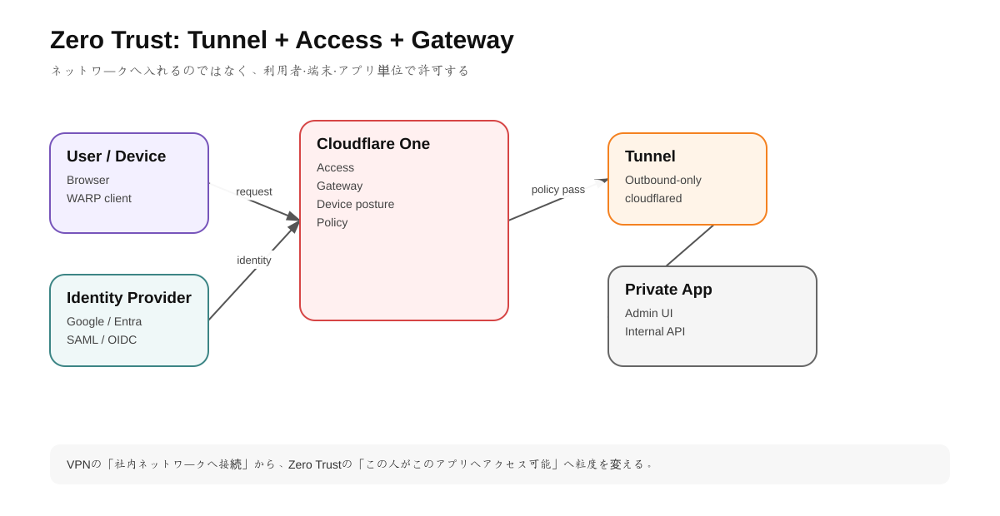
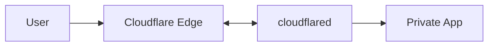
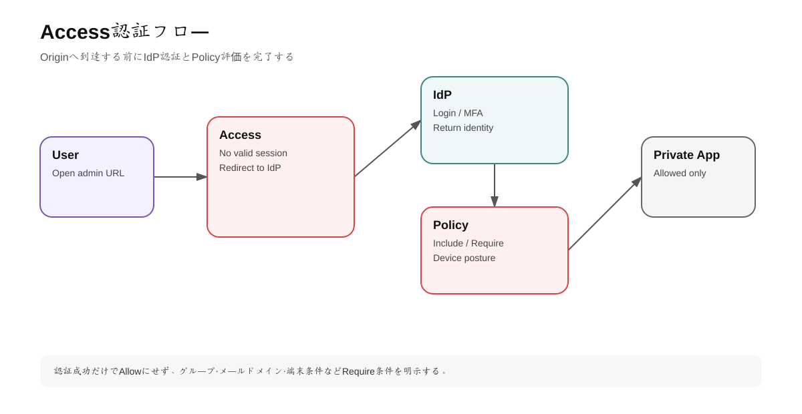

# 第6章 Zero Trust: Access・Tunnel・Gateway・WARP

## 1. 学習目標

Cloudflare Zero Trustは「VPNを置き換える製品」という説明だけでは不十分。

この章では、

- User identity
- Device
- Application
- Private network
- Internet access

をCloudflare経由でどう制御するか理解する。

---

## 2. VPNとZero Trustの考え方の違い

従来VPN:

```text
User
  ↓ VPN login
Corporate Network
  ↓
Many internal resources
```

VPNへ入れた時点でnetwork reachabilityが広がりやすい。

Zero Trust:

```text
User
 ↓ identity + device + policy
Cloudflare Access
 ↓ app-specific decision
Only authorized application
```

基本思想は「networkへ入れたから信頼する」のではなく、requestごとにidentity/contextを評価する。

---

## 3. Cloudflare Oneの主要要素

<!-- visual:start -->


> **図の要点:** Accessは「誰が何へアクセスできるか」、Tunnelは「Originを外へ安全につなぐ」、Gateway/WARPは利用端末側の通信制御を担う。
<!-- visual:end -->

### Access

Identity-aware proxy。

Self-hosted appやSaaS appの前で、誰がアクセスできるか判断する。

### Tunnel

Private resourceとCloudflare Networkを接続するoutbound-only connector。

### Cloudflare One Client / WARP

端末trafficをCloudflareへ接続するclient。

Private networkへの接続やGateway policy適用に使う。

### Gateway

DNS / HTTP / network trafficにpolicyを適用するsecure web gateway機能。

---

## 4. Cloudflare Tunnelのアーキテクチャ

Origin側に `cloudflared` を動かす。



`cloudflared` からCloudflareへoutbound connectionを張るため、Originにpublic routable IPを必須としない。

公式ドキュメントではTunnel connectorはCloudflareへ複数のconnectionを確立し、冗長性を持つ。さらに複数connector replicaを配置できる。

### 実務メリット

- Inbound portを閉じやすい
- Origin IPをpublic DNSへ出さなくてよい
- NAT/Firewallの内側から公開可能
- Accessと組み合わせやすい

---

## 5. Public applicationとPrivate network

Tunnelには大きく二つの利用形態がある。

### Public hostname

```text
admin.example.com
-> Tunnel
-> localhost:3000
```

Internetからhostnameへアクセスできるが、Cloudflare経由でOriginへ届く。

これにAccessを組み合わせれば認証必須にできる。

### Private hostname / IP

WARP client等を使い、社内private resourceへ接続する。

```text
10.0.0.0/8
internal.example.local
```

---

## 6. Access Application

<!-- visual:start -->


> **図の要点:** Originへ到達する前にIdP認証とPolicy評価を完了し、許可された利用者だけをPrivate Appへ通す。
<!-- visual:end -->

Accessはapplication単位でpolicyを適用する。

例:

```text
Application: admin.example.com

Allow:
- email ends with @example.com
Require:
- country JP
- device posture compliant
```

Access Policyの主要構成:

- Action: Allow / Block / Bypass / Service Auth
- Rule type: Include / Require / Exclude
- Selector: email, IdP group, country, device posture等
- Value

### IncludeとRequire

概念的には:

```text
Include: 対象候補
Require: さらに必須条件
Exclude: 例外除外
```

複雑なpolicyでは論理を紙に書いてから設定する。

---

## 7. Identity Provider

AccessはGoogle、Microsoft Entra ID、Okta、GitHub、SAML/OIDC等と統合可能。

小規模検証ではOne-time PINも利用できる。

2026年時点では新しいZero Trust organizationではCloudflare identity providerがdefault login methodで、OTPは必要に応じて追加する形になっている。

### OTPの用途

- 外部協力者
- 小規模検証
- IdP integration前のlab

本番企業利用では組織IdP + MFA + group管理を基本にする。

---

## 8. Service-to-Service Access

人間だけでなくmachine trafficもAccess対象にできる。

例:

```text
GitHub Actions
  ↓ service credential
Access
  ↓
Internal deployment API
```

人間のOTPやbrowser loginをCIへ流用しない。

Service token、mTLS、OIDC等、用途に応じたmachine identityを使う。

---

## 9. Gateway

Gatewayは「社内private appへ入る」だけでなく、端末からInternetへ出ていくtrafficをpolicy制御する。

### DNS policy

- Malware domain block
- Category filtering
- custom domain block

### HTTP policy

- URL / host / method等を基にcontrol
- Identity contextとの組み合わせ

### Network policy

IP/port/protocol等を制御。

GatewayはAccessと方向が異なると考えると理解しやすい。

```text
Access: User -> internal/app resource
Gateway: User -> Internet/network destination
```

---

## 10. WARP / Cloudflare One Client

Client deviceからCloudflareへtrafficを送るためのsoftware client。

用途:

- Private network route
- Gateway policy
- Device posture
- DNS filtering

### 1.1.1.1 appとの混同に注意

Consumer向けWARPとenterprise Zero Trust clientは同じ技術基盤を持つ部分があるが、企業管理・policy適用の文脈ではCloudflare One Clientとして管理する。

---

# ハンズオン6: ローカルWebアプリをTunnel + Accessで保護

## ゴール

ローカルの `http://localhost:3000` を、public portを開けずに `admin.example.com` で公開し、Access認証を要求する。

### Step 1 ローカルアプリ

任意のWeb serverを起動。

```bash
python3 -m http.server 3000
```

### Step 2 Tunnel作成

DashboardのZero Trust / Networks / TunnelsからTunnelを作る。

表示されたinstall commandで `cloudflared` をserverへ導入する。

### Step 3 Public hostname

```text
Hostname: admin.example.com
Service: http://localhost:3000
```

### Step 4 Access Application作成

Self-hosted applicationとして `admin.example.com` を登録。

### Step 5 Policy

学習環境ではOTPまたは利用中IdPを選び、自分のmail addressだけ許可する。

### Step 6 動作確認

未認証browser:

```text
admin.example.com
-> Cloudflare Access login
-> successful auth
-> localhost:3000
```

### Step 7 Origin exposure確認

Firewallでpublic inbound 3000を開けていないことを確認する。

---

## 11. High Availability

Tunnel connectorを一台だけに置くと、そのhost障害でresourceへ到達できなくなる。

複数の `cloudflared` replicaを配置する。

```text
Cloudflare
  ├ connector A -> app cluster
  └ connector B -> app cluster
```

各connectorはCloudflare Networkへ複数connectionを張るが、host自体の故障対策としてreplicaが必要。

---

## 12. Security設計

### Tunnel token/credential

漏洩するとunauthorized connector作成等のリスクになる。secret管理する。

### Access policy

`Everyone` Allowを一時検証後に残さない。

### Bypass

Access Bypassは慎重に使う。

Webhook pathだけmachine trafficのため例外にする場合も、source validation、secret、signature等で守る。

### Device posture

高機密systemではidentityだけでなく、

- managed device
- OS version
- disk encryption
- certificate

等を条件に追加する。

---

## 13. 業務メリット

### UX

- 毎回VPN全体へ接続せずbrowserからappへ入れる
- IdP SSOを利用できる

### Security

- Network-level trustからapplication-level trustへ移せる
- Origin inbound exposureを減らせる
- User/group単位でpolicyを作れる

### Operations

- VPN appliance保守を減らせる可能性
- IdP退職処理とAccess権限を連動しやすい
- Access logsを監査へ使える

---

## 14. 向いていないケース / 注意

- 全プロトコルがbrowser-friendlyとは限らない
- Source IPがOriginへそのまま見えないケースがある
- Server-initiated protocol等、Tunnelの性質と合わないtrafficがある
- Latency-sensitive特殊networkでは実測が必要
- IdP障害がAccess障害要因になる

---

## 理解チェック

- Tunnelがoutbound-onlyである利点は何か。
- AccessとGatewayのtraffic directionの違いは何か。
- OTPを企業本番のprimary identityにしない理由は何か。
- Tunnel connector replicaが必要な理由は何か。
- VPNとZero Trustのtrust boundaryの違いを説明できるか。

---

## 公式ドキュメント

- Cloudflare Tunnel: https://developers.cloudflare.com/cloudflare-one/networks/connectors/cloudflare-tunnel/
- Tunnel availability: https://developers.cloudflare.com/cloudflare-one/networks/connectors/cloudflare-tunnel/configure-tunnels/tunnel-availability/
- Access policies: https://developers.cloudflare.com/cloudflare-one/access-controls/policies/
- Self-hosted applications: https://developers.cloudflare.com/cloudflare-one/access-controls/applications/http-apps/
- One-time PIN: https://developers.cloudflare.com/cloudflare-one/integrations/identity-providers/one-time-pin/
- Connectivity options: https://developers.cloudflare.com/cloudflare-one/networks/connectivity-options/
