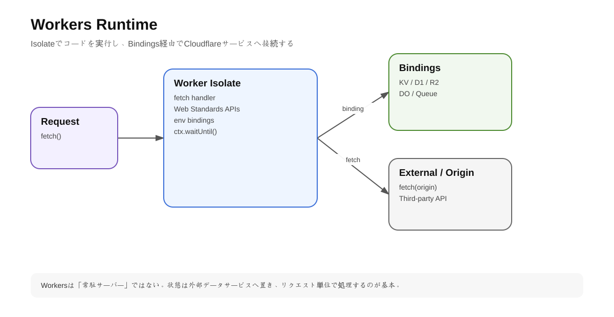
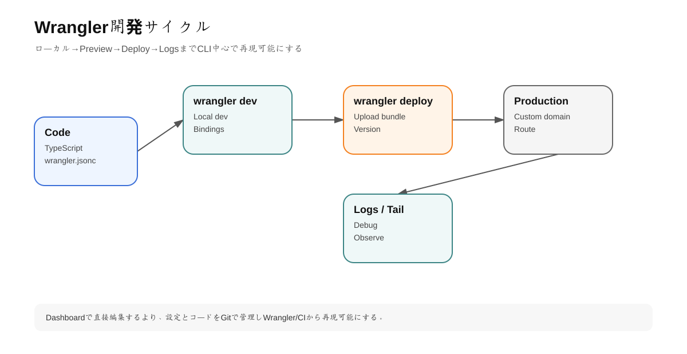

# 第7章 Cloudflare Workers: Runtime・Wrangler・Routing

## 1. 学習目標

Workersを「AWS LambdaのCloudflare版」とだけ捉えると設計を誤る。

この章ではV8 Isolate、distributed execution、bindings、routing、deploymentを理解し、TypeScript APIを実際にdeployする。

---

## 2. Workersの実行モデル

<!-- visual:start -->


> **図の要点:** Workerは常駐サーバーではなく、Isolate上でリクエストを処理し、状態はBindingsや外部サービスへ置く。
<!-- visual:end -->

WorkersはV8 Isolateを基盤とする。

Container/VMごとにruntimeを立ち上げるモデルと異なり、一つのruntime process内で多数のisolatesを動かせる。

主な特徴:

- startupが軽い
- requestに近いCloudflare locationで実行される
- isolate間memoryは分離
- lifecycleは永続保証されない

### 重要

Worker instance/global scopeはdatabaseではない。

```ts
let counter = 0;

export default {
  async fetch() {
    counter++;
    return new Response(String(counter));
  }
}
```

この値が全ユーザーで正しく連番になる保証はない。

理由:

- requestが別locationへ行く
- isolateがevictされる
- 同じWorkerが複数instanceで実行される

stateが必要ならKV、D1、Durable Objects等を使う。

---

## 3. Fetch Handler

ES modules形式の基本Worker:

```ts
export default {
  async fetch(request: Request, env: Env, ctx: ExecutionContext) {
    return new Response('Hello Cloudflare');
  },
};
```

### request

Incoming HTTP request。

### env

Bindings / environment variables / secrets等。

### ctx

request lifecycle関連機能。

非同期後処理などで `waitUntil()` を使うケースがある。

---

## 4. Web Standards API

WorkersはWeb Platform APIに近いモデルを採用する。

よく使うもの:

- `Request`
- `Response`
- `fetch`
- `URL`
- `Headers`
- Streams
- Web Crypto

Node.js compatibilityも拡張されているが、すべてを「普通のNode server」と考えず、Workers runtime compatibilityを確認する。

---

## 5. C3とWrangler

<!-- visual:start -->


> **図の要点:** ローカル開発・Deploy・LogsまでCLIで再現可能にし、Dashboard上の手作業を減らすとチーム運用しやすい。
<!-- visual:end -->

2026年時点の公式getting startedはC3を使う。

```bash
npm create cloudflare@latest -- my-worker
cd my-worker
```

開発:

```bash
npx wrangler dev
```

Deploy:

```bash
npx wrangler deploy
```

### Wranglerの役割

- local dev
- deployment
- resource作成
- bindings設定
- secrets管理
- logs/tail
- D1/R2/KV操作
- types生成

DashboardだけでなくCLIを使えることが実務上重要。

---

## 6. `wrangler.jsonc`

例:

```jsonc
{
  "name": "cf-learning-api",
  "main": "src/index.ts",
  "compatibility_date": "2026-08-31",
  "observability": {
    "enabled": true
  }
}
```

### compatibility_date

Workers Runtimeの挙動変更を段階的に取り込む仕組み。

「今日の日付に自動更新すればよい」ではなく、dependency updateと同様に変更点をtestして更新する。

---

## 7. Bindings

WorkersからCloudflare resourceへアクセスするためのinterface。

例:

```ts
interface Env {
  DB: D1Database;
  BUCKET: R2Bucket;
  CONFIG: KVNamespace;
}
```

コードではHTTP経由でcredentialを自前管理するのではなく、bindingとしてresourceへアクセスできる。

```ts
const value = await env.CONFIG.get('feature_flag');
```

これはCloudflare Developer Platformの重要な設計思想。

---

## 8. SecretsとEnvironment Variables

Secretをgitへcommitしない。

```bash
npx wrangler secret put API_KEY
```

非機密設定:

```jsonc
{
  "vars": {
    "APP_ENV": "production"
  }
}
```

### 原則

```text
Public config -> vars
Secret -> secrets / secret store
Resource handle -> binding
```

---

## 9. Workers Routing

WorkersをInternetへ接続する主な方法は3つ。

### workers.dev

検証用のsubdomain。

```text
my-worker.account.workers.dev
```

公式はproduction business-critical workloadにCustom Domain/Routeを推奨している。

### Custom Domain

Worker自身がapplication originになる場合に向く。

```text
api.example.com
-> Worker
```

DNS recordとcertificateをCloudflareが管理する。

### Route

既存Originの前にWorkerを挟む。

```text
example.com/api/*
-> Worker
-> existing origin
```

既存siteの一部pathだけedge logicを追加する用途に向く。

---

## 10. RouteとCustom Domainの設計判断

| 状況 | 推奨 |
|---|---|
| Workerが完全なOrigin | Custom Domain |
| Existing originの前処理 | Route |
| 検証 | workers.dev |

### 例

Legacy WordPress前でheader追加:

```text
Route: example.com/*
Worker -> fetch(origin)
```

新規API:

```text
Custom Domain: api.example.com
Worker -> D1/R2
```

---

## 11. CPU timeとWall time

Workers課金・limitsを理解する際にCPU timeとdurationを混同しない。

### CPU time

JavaScriptがCPUで実際に処理している時間。

### Waiting / I/O

`fetch()` やdatabase/network待ち時間はCPU timeと同一ではない。

ただしlimitsはhandler typeやplanで異なるため、production設計では最新のWorkers Limitsを確認する。

2026-07時点の公式limitsではFreeはrequestあたりCPU 10ms、Paidは通常requestで最大5分などの値が掲載されているが、変更され得る。

---

# ハンズオン7: TypeScript API Worker

## Step 1 Project作成

```bash
npm create cloudflare@latest -- cf-api-lab
cd cf-api-lab
```

選択:

```text
Hello World
Worker only
TypeScript
Git: Yes
Deploy: No
```

## Step 2 API実装

`src/index.ts`

```ts
interface Env {
  APP_ENV: string;
}

export default {
  async fetch(request: Request, env: Env): Promise<Response> {
    const url = new URL(request.url);

    if (url.pathname === '/api/health') {
      return Response.json({
        ok: true,
        env: env.APP_ENV,
        now: new Date().toISOString(),
      });
    }

    return new Response('Not Found', { status: 404 });
  },
} satisfies ExportedHandler<Env>;
```

## Step 3 vars

`wrangler.jsonc`

```jsonc
{
  "vars": {
    "APP_ENV": "development"
  }
}
```

## Step 4 Local

```bash
npx wrangler dev
curl http://localhost:8787/api/health
```

## Step 5 Deploy

```bash
npx wrangler deploy
```

## Step 6 Production hostname

検証後、Cloudflare zoneにCustom Domainを設定する。

```text
api-lab.example.com
```

## Step 7 `workers.dev` disable検討

ProductionをCustom Domainに限定したい場合はworkers.dev routeを不要に公開し続けない。

---

## 12. Existing OriginをProxyするWorker

```ts
export default {
  async fetch(request: Request): Promise<Response> {
    const upstream = new URL(request.url);
    upstream.hostname = 'origin.example.net';

    const response = await fetch(new Request(upstream, request));
    const headers = new Headers(response.headers);
    headers.set('x-edge-worker', '1');

    return new Response(response.body, {
      status: response.status,
      headers,
    });
  },
};
```

### 注意

単純header操作だけならTransform Rulesの方が良い。Workerを使う理由を明確にする。

---

## 13. Worker設計原則

### Stateless by default

Global mutable stateを信用しない。

### Streaming

大きいresponseを不必要にbufferしない。

### Bindings first

Cloudflare resourceへはbindingを優先する。

### Fail fast

External API failureのtimeout/retryを設計する。

### Observability first

Production前にlogs/metricsを有効化する。

---

## 14. よくある誤り

- WorkersをNode.js serverそのものと考える
- global variableをpersistent stateとして使う
- `workers.dev` を業務本番URLにする
- Secretをwrangler fileへ直書き
- Workerで全部実装しRulesを使わない
- External fetchを無制限に直列実行
- CPU time/limitsを確認せず重い処理を載せる

---

## 理解チェック

- V8 Isolateのメリットを説明できるか。
- Worker global stateを信用できない理由は何か。
- Custom DomainとRouteを使い分けられるか。
- Bindingとは何か。
- compatibility dateを更新管理する理由は何か。

---

## 公式ドキュメント

- How Workers works: https://developers.cloudflare.com/workers/reference/how-workers-works/
- Getting started: https://developers.cloudflare.com/workers/get-started/guide/
- Routes and domains: https://developers.cloudflare.com/workers/configuration/routing/
- Custom Domains: https://developers.cloudflare.com/workers/configuration/routing/custom-domains/
- Workers routes: https://developers.cloudflare.com/workers/configuration/routing/routes/
- workers.dev: https://developers.cloudflare.com/workers/configuration/routing/workers-dev/
- Limits: https://developers.cloudflare.com/workers/platform/limits/
