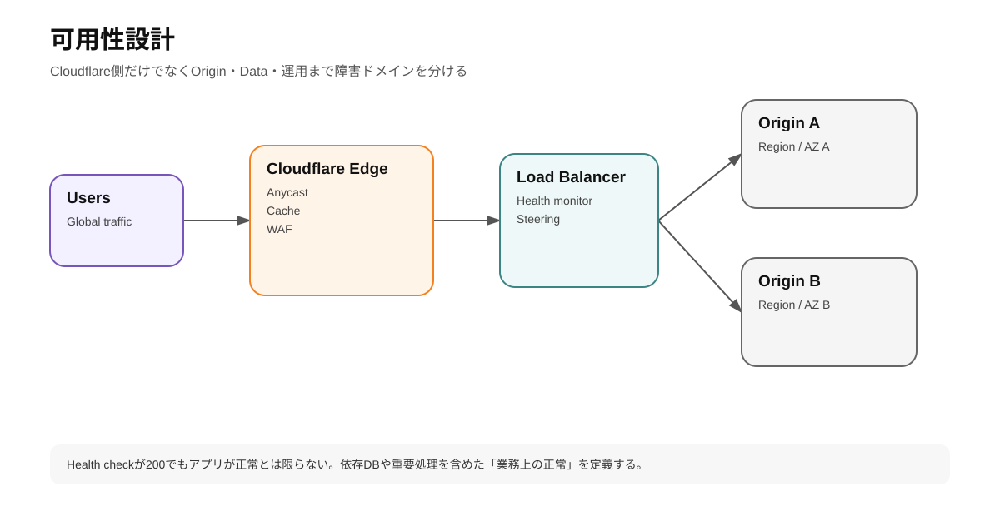
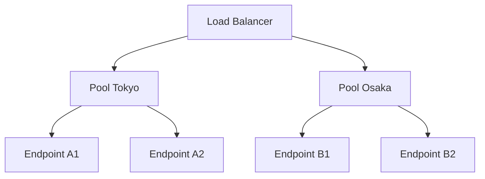
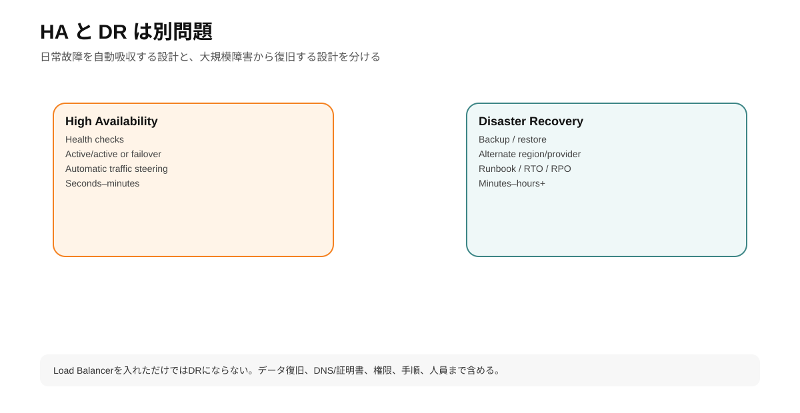

# 第10章 可用性・Load Balancing・Origin設計

## 1. 学習目標

Cloudflareを前段へ入れても、Originが1台で壊れればCache MISSやdynamic requestは失敗する。

この章ではCloudflareを使ったavailability designを扱う。

---

## 2. Availabilityは層ごとに考える

<!-- visual:start -->


> **図の要点:** Edgeが高可用でもOriginが単一障害点ならサービスは落ちる。Health Check・Traffic Steering・データ層まで一体で設計する。
<!-- visual:end -->

```text
DNS availability
Cloudflare Edge availability
Worker availability
Data layer availability
Origin availability
External API availability
```

Cloudflare CDNが高可用でも、application architecture全体が高可用になるわけではない。

---

## 3. Origin構成パターン

### Pattern A: Single Origin

```text
Cloudflare -> Origin A
```

小規模siteでは十分な場合がある。

Risk:

- server failure
- region outage
- deploy failure

### Pattern B: Active/Passive

```text
Cloudflare LB
  ├ Primary Origin
  └ Failover Origin
```

Primary unhealthy時にFailover。

### Pattern C: Active/Active

```text
Cloudflare LB
  ├ Region A
  └ Region B
```

traffic steeringで両方利用。

DB consistency、session、uploads等のstate設計が難しくなる。

---

## 4. Cloudflare Load Balancingの構成要素

Cloudflare Load Balancingは主に:

1. Load Balancer
2. Pools
3. Endpoints
4. Monitors

で構成される。



---

## 5. Health Monitors

Monitorが定期的にendpointへprobeしhealthを判定する。

確認可能な条件には構成に応じて:

- HTTP status
- response body text
- timeout
- protocol
- path

等がある。

### `/health` endpoint設計

悪い例:

```text
return 200 always
```

これではDBが死んでもhealthy。

一方、すべてのexternal dependencyを同期確認してhealth endpoint自体が重くなるのも問題。

推奨は用途を分ける。

```text
/livez   -> process is alive
/readyz  -> requestを受けられる最低条件
```

Cloudflare Load Balancer monitorがどこまで見るべきかはapplication特性で決める。

---

## 6. Traffic Steering

Pool選択に使うpolicy。

Cloudflareにはplan/featureに応じて:

- Failover order
- Random
- Geo
- Dynamic
- Proximity

等の選択肢がある。

### Geo

地域ごとにregionを選びたい場合。

```text
Japan -> Tokyo
EU -> Frankfurt
US -> Virginia
```

Data residencyやlegal requirementにも関係する。

### Dynamic

latency測定等を用いてpoolを選ぶadvanced option。

---

## 7. Endpoint Steering

Pool内でどのendpointへ送るか。

例:

- Random
- Hash
- Least Outstanding Requests

weightも設定できる。

### Canary release

```text
endpoint v1 weight 9
endpoint v2 weight 1
```

のようなweight利用を考えられるが、release managementとしてWorkers gradual deployment等の方が適する場合もある。

Layerを混同しない。

---

## 8. Session Affinity

Stateful applicationでuserを同じOriginへ寄せたい場合に必要になることがある。

ただしCloud native設計としては:

```text
Web server local session
```

へ依存するより:

```text
shared session store / stateless auth
```

に寄せた方がscale/failoverしやすい。

Load Balancer sticky sessionはlegacy compatibilityとして必要な場合もあるが、application architectureの課題を隠していないか確認する。

---

## 9. CacheとAvailability

Cache HITはOrigin障害中でもcontentを返せる場合がある。

ただしTTL expirationやdynamic contentではOriginが必要。

Availability改善には:

- cacheable contentを増やす
- stale serving policyを検討
- Origin failover
- static error page

を組み合わせる。

「CDNがあるからOrigin outageでもsiteは動く」ではない。

---

## 10. Tiered CacheとOrigin負荷

Tiered CacheはOriginへrequestするEdge locationを集約しやすくするため、Origin connection pressure低減にも効く。

これはavailabilityにも寄与する。

```text
Traffic spike
-> many Edge misses
-> Tiered Cache upper tier
-> fewer origin connections
```

---

## 11. Argo Smart RoutingとAvailability

ArgoはInternet congestion/network issueを避ける経路選択を行う。

Originがhealthyでもnetwork pathが不安定な場合に有効。

ただしOrigin process failureはArgoでは直せない。

```text
Bad network path -> Argo
Bad origin -> Load Balancing/failover
Heavy origin -> Cache/Tiered Cache/scaling
```

---

## 12. TunnelのHigh Availability

`cloudflared`は複数connectionをCloudflareへ確立するが、host障害に備えてreplicaを別hostへ配置する。

```text
Cloudflare
  ├ Tunnel connector VM-A
  └ Tunnel connector VM-B
```

同じphysical host上に2process置いてもhost failureには弱い。

Availability domainを分ける。

---

# ハンズオン10: Load Balancer設計演習

実際のadd-on契約がない場合でも、構成設計だけ行う。

## 要件

Corporate API:

```text
Primary: Tokyo origin
Secondary: Osaka origin
Failover RTO: automatic
Health endpoint: /readyz
```

## 設計

```yaml
load_balancer:
  hostname: api.example.com
  steering: failover

pools:
  - name: tokyo
    priority: 1
    endpoints:
      - origin-tokyo-1.example.net
  - name: osaka
    priority: 2
    endpoints:
      - origin-osaka-1.example.net

monitor:
  type: https
  path: /readyz
  expected_status: 200
```

### Test plan

1. Both healthy
2. Tokyo returns 500
3. Tokyo timeout
4. Osaka healthy
5. Tokyo recovers
6. Flapping behavior

### Application consistency test

Failover後:

- Login session継続?
- Upload file available?
- DB update visible?
- Cache key同じ?
- CSRF/session secret共通?

Load Balancerだけ成功してもapplication failoverが成功するとは限らない。

---

## 13. Disaster Recovery

<!-- visual:start -->


> **図の要点:** Load Balancingによる自動フェイルオーバーはHA。バックアップ・復旧手順・RTO/RPOまで含むDRとは分けて設計する。
<!-- visual:end -->

High AvailabilityとDisaster Recoveryを分ける。

### HA

日常的なcomponent failureへ自動対応。

### DR

region/account/operator事故など大きなfailureから復旧。

確認:

- DNS zone backup/export
- IaC
- R2/data backup
- D1 Time Travel/export
- secrets recovery
- alternate provider/origin option
- runbook

Cloudflare account自体へ入れない状況も想定する。

---

## 14. Vendor Concentration Risk

CloudflareへDNS、WAF、Workers、DB、Storageを集約すると運用は簡素化する一方、Cloudflare障害/アカウント問題のblast radiusが大きくなる。

対策は全サービスをmulti-cloudにすることとは限らない。

Cost/complexityに応じて:

- DNS config export
- portable application data
- standard S3 API利用
- SQLite/Postgres compatible data model
- IaC
- alternate DNS/origin runbook

など「復旧可能性」を確保する。

---

## 理解チェック

- Load Balancer / Pool / Endpoint / Monitorの関係を説明できるか。
- Health endpointでDBまで確認すべきか判断基準を説明できるか。
- ArgoとLoad Balancingの違いは何か。
- Tunnel connectorを2台にする意味は何か。
- CDN cacheがOrigin outageを完全には隠せない理由は何か。

---

## 公式ドキュメント

- Load Balancing: https://developers.cloudflare.com/load-balancing/
- Components: https://developers.cloudflare.com/load-balancing/understand-basics/load-balancing-components/
- Traffic steering: https://developers.cloudflare.com/load-balancing/understand-basics/traffic-steering/
- Monitors: https://developers.cloudflare.com/load-balancing/monitors/
- Reference architecture: https://developers.cloudflare.com/reference-architecture/architectures/load-balancing/
- Tiered Cache: https://developers.cloudflare.com/cache/how-to/tiered-cache/
- Argo Smart Routing: https://developers.cloudflare.com/argo-smart-routing/
