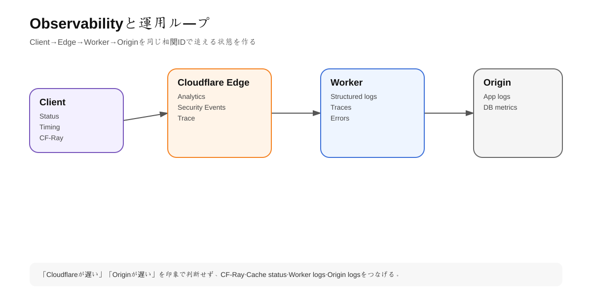
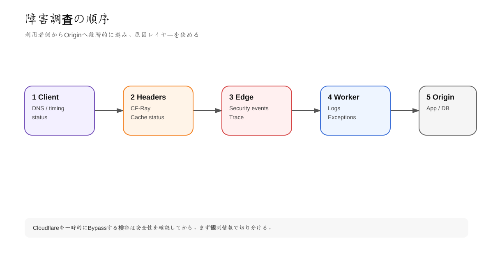

# 第11章 Observability・API・IaC・運用設計

## 1. 学習目標

Cloudflareを専門的に扱うには「設定できる」だけでは足りない。

障害時に:

- どのruleがmatchしたか
- Edgeで止まったか
- Workerでerrorか
- Originで500か
- Cache HIT/MISSか

を切り分けられる必要がある。

---

## 2. Observabilityの3層

<!-- visual:start -->


> **図の要点:** CF-Rayなどの相関情報を使い、Client・Edge・Worker・Originのどのレイヤーで遅延/エラーが起きたかを追える状態を作る。
<!-- visual:end -->

```text
Traffic analytics
Worker application telemetry
Origin/application telemetry
```

Cloudflareだけ見てもDB internal errorまでは分からない。Origin APMだけ見てもEdgeでBlockされたrequestは見えない。

両方をcorrelateする。

---

## 3. 最初に見るHTTP情報

### CF-Ray

Cloudflare requestの識別に重要。

```bash
curl -I https://example.com
```

```text
cf-ray: 1234567890abcdef-NRT
```

Support/debugで時刻、URL、Ray IDをセットで残す。

### CF-Cache-Status

Cache layerの調査。

### Status code

Cloudflare error codeとOrigin statusを区別する。

例:

- 52x: Cloudflare-Origin connection系を疑う
- 403: WAF/Access/app auth等複数可能性

statusだけで原因断定しない。

---

## 4. Cloudflare Trace

Traceは特定URL/requestに対して、Cloudflare configurationがどう適用されるか調べるための重要tool。

Rulesが多いsiteでは:

```text
Does Cache Rule match?
Which Origin Rule applied?
Which Transform Rule executed?
```

を確認する。

「Dashboardを目視して合っているはず」よりTraceで実request behaviorを確認する。

---

## 5. Workers Logs

2026年時点では新規Workersでobservabilityがdefault enabledになる動きが公式documentに示されている。

Workers Logsには:

- invocation logs
- custom logs
- errors
- uncaught exceptions

などが保存され、dashboardでqueryできる。

Wrangler config:

```jsonc
{
  "observability": {
    "enabled": true
  }
}
```

### Structured logging

Bad:

```ts
console.log('error');
```

Better:

```ts
console.log(JSON.stringify({
  level: 'error',
  event: 'user_lookup_failed',
  requestId,
  userId,
  upstreamStatus,
}));
```

ただしPII/secret/tokenをlogしない。

---

## 6. Traces

Workers observabilityはfetchやbindings operation等のend-to-end tracingを提供する方向へ拡張されている。

Traceで見たいもの:

```text
Request
 -> Worker handler
 -> D1 query
 -> external fetch
 -> R2 read
 -> response
```

Latency breakdownが分かれば「Workerが遅い」のではなく「external APIが600ms」と切り分けられる。

---

## 7. OpenTelemetry export

2026年のWorkers docsでは、third-party observability integrationの新規構成でOpenTelemetry exportが推奨されている。

利用先例:

- Grafana stack
- Datadog等OTLP対応service
- 自社collector

Cloudflareだけにlogを閉じず既存observability stackへ統合できる。

---

## 8. Tail Workers / Real-time logs

Tail Workersはproducer Workerのexecution eventを受け取り、filter/transformして外部endpointへ送る等の用途に使える。

用途:

- custom alert pipeline
- security event enrichment
- real-time debugging

ただしlogging pipeline自体もcode/cost/failureを持つため、標準Logs/OTelで十分なら複雑化しない。

---

## 9. API Tokens

Cloudflare API authenticationではlegacy Global API KeyよりAPI Tokenを優先する。

### Least privilege

悪い例:

```text
All zones: Edit everything
No expiration
CI secret
```

良い例:

```text
Token: production-cache-purge
Resource: example.com only
Permission: Cache Purge only
TTL: appropriate
IP restriction: where possible
```

### Token type

用途に応じてuser token / account-owned tokenを検討する。

人に紐づくCI credentialを退職後まで使い続けない。

---

## 10. Token secret管理

公式ではtoken secretは作成時に一度だけ表示される。

保存先:

- GitHub Actions Secrets
- Cloudflare Secrets Store / Worker secrets
- Organization secret manager

禁止:

- `.env` commit
- Slack貼り付け
- Wiki plain text
- source code literal

### Rotation

Tokenは「漏れたら変える」のではなく、定期rotationとincident rotation手順を持つ。

---

## 11. API自動化

Cloudflare APIで操作できるため、CMS publish時cache purge等をautomationできる。

概念:

```text
CMS publish
 -> webhook
 -> backend/Worker
 -> Cloudflare API
 -> purge article URL
```

API tokenはそのzoneのCache Purge permissionだけに絞る。

「global keyで全部操作可能」にしない。

---

## 12. Terraform / IaC

Cloudflare settingsをTerraformで管理する目的:

- Review
- Reproducibility
- Environment parity
- Audit
- Disaster recovery

管理候補:

- DNS records
- Rulesets
- Access policies
- Tunnel config
- Workers routes
- Load Balancing
- API-related settings

### State drift

Dashboard手動変更とTerraformを併用するとdriftする。

運用rule:

```text
Learning / emergency: dashboard allowed
Production canonical config: IaC
```

のように明示する。

---

## 13. CI/CD

Workers deploymentを例に:

```text
Pull Request
 -> lint
 -> typecheck
 -> unit test
 -> integration test
 -> preview deploy
 -> review
main merge
 -> production deploy
 -> smoke test
```

### Secret分離

Preview Workerがproduction D1/R2へ書けないようresource bindingを分離する。

### Deployment rollback

Workersにはversion/deployment/rollback機能がある。release前にrollback方法を確認する。

「問題が出たら考える」では遅い。

---

## 14. Monitoring SLO

Cloudflare metricsをbusiness SLOへ接続する。

例:

```yaml
service: public-web
slo:
  availability: 99.9%
  p95_ttfb: < 500ms
  error_rate_5xx: < 0.5%

signals:
  - cloudflare requests
  - worker errors
  - origin 5xx
  - cache hit ratio
  - application APM
```

### Cache hit ratioだけ高くても駄目

Personalized contentを誤cacheすればhit ratioは高くても事故。

Metricsは目的に対する指標として解釈する。

---

# ハンズオン11: Debug Runbookを作る

<!-- visual:start -->


> **図の要点:** Client側の事実から始め、Headers → Edge → Worker → Originの順で切り分けると無駄な設定変更を減らせる。
<!-- visual:end -->

## 症状

`https://app.example.com` が遅い。

## Runbook

### 1. Client

```bash
curl -sS -o /dev/null -w '%{http_code} %{time_connect} %{time_starttransfer} %{time_total}\n' https://app.example.com
```

### 2. Headers

```bash
curl -I https://app.example.com
```

記録:

- status
- cf-ray
- cf-cache-status
- cache-control
- server timing if any

### 3. Cloudflare Analytics

- request volume spike?
- 5xx increase?
- WAF challenge/block spike?

### 4. Worker

- error rate
- CPU time
- traces
- external fetch latency

### 5. Origin

- CPU/memory
- DB latency
- access logs

### 6. Compare bypass path only if safe

Origin直アクセス検証を行う場合も、本番Originをpublic exposeしない。internal test pathやcontrolled hostを使う。

---

## 15. Change Management

Cloudflare rule変更もproduction change。

最低限:

```text
ticket / issue
change reason
before/after
risk
test cases
rollback
owner
change time
```

WAF Ruleを1個追加するだけでもsite全体をBlockできるため、コード変更と同等のreview対象にする。

---

## 16. よくある誤り

- Global API KeyをCIへ入れる
- Cloudflare logだけでapplication root causeを断定する
- PII/tokenをconsole.logする
- Dashboard変更を記録しない
- Previewとproduction resourceを共有する
- rollback手順なしでRules/WAFを変更する
- Cache HIT ratioだけをperformance KPIにする

---

## 理解チェック

- CF-Rayを障害調査でどう使うか。
- Workers LogsとOrigin logsの両方が必要な理由は何か。
- API Tokenをleast privilegeにする方法を説明できるか。
- IaC化の価値は何か。
- OTel exportを使う理由を説明できるか。

---

## 公式ドキュメント

- Workers Observability: https://developers.cloudflare.com/workers/observability/
- Workers Logs: https://developers.cloudflare.com/workers/observability/logs/workers-logs/
- Tail Workers: https://developers.cloudflare.com/workers/observability/logs/tail-workers/
- API tokens: https://developers.cloudflare.com/fundamentals/api/get-started/create-token/
- API overview: https://developers.cloudflare.com/fundamentals/api/get-started/

