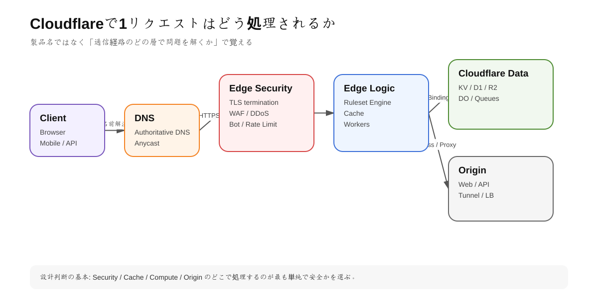

<section class="home-hero">
  

    
A PRACTICAL FIELD GUIDE / 2026

    <h1>Cloudflare <em>実務</em> 学習ガイド</h1>
    
DNS、セキュリティ、CDN、Workers、データ基盤まで。 プロダクト名の暗記ではなく、<strong>設計の判断</strong>を身につけるための13章。

    

      <a class="button button--primary" href="00_README.html">学習をはじめる →</a>
      <a class="text-action" href="#chapters">章一覧を見る ↓</a>
    

  

  

    
01 / REQUEST LIFECYCLE

    
    EDGE FIRST
  

</section>

<section class="manifesto">
  
THE APPROACH

  
Cloudflareを「設定画面の集合」としてではなく、 一つのリクエストが通る<strong>システム全体</strong>として捉える。

</section>

<section class="guide-intro">
  

    
HOW TO USE THIS GUIDE

    <h2>読む。試す。 確認する。</h2>
  

  

    
各章は概念だけで終わりません。目的を理解し、検証環境で手を動かし、レスポンスやログから結果を確かめるところまでを一つの学習単位にしています。

    <a class="text-action" href="00_README.html">学習方法と必要な環境を見る →</a>
  

</section>

<section id="chapters" class="chapter-section">
  

    
THE 13 CHAPTERS

    <h2>基礎から、 本番設計まで。</h2>
  

  

    <a class="chapter-card chapter-card--feature" href="01_Cloudflare全体アーキテクチャ.html">01<strong>全体 アーキテクチャ</strong><small>最初に読む</small></a>
    <a class="chapter-card" href="02_DNS_TLS_オリジン保護.html">02<strong>DNS / TLS オリジン保護</strong></a>
    <a class="chapter-card" href="03_CDNキャッシュ_パフォーマンス.html">03<strong>CDN / Cache パフォーマンス</strong></a>
    <a class="chapter-card chapter-card--dark" href="04_WAF_DDoS_Bot_RateLimiting.html">04<strong>WAF / DDoS Bot / Rate Limit</strong></a>
    <a class="chapter-card" href="05_RulesetEngine_ルーティング.html">05<strong>Ruleset Engine ルーティング</strong></a>
    <a class="chapter-card" href="06_ZeroTrust_Access_Tunnel_Gateway.html">06<strong>Zero Trust Access / Tunnel</strong></a>
    <a class="chapter-card chapter-card--accent" href="07_Workers_Runtime_Wrangler.html">07<strong>Workers Wrangler</strong></a>
    <a class="chapter-card" href="08_Storage_Data_KV_R2_D1_DO_Queues_Hyperdrive.html">08<strong>Data / Storage KV / R2 / D1</strong></a>
    <a class="chapter-card" href="09_FullStack_静的配信_フレームワーク.html">09<strong>Full-stack 静的配信</strong></a>
    <a class="chapter-card chapter-card--dark" href="10_可用性_LoadBalancing_Origin設計.html">10<strong>可用性 Load Balancing</strong></a>
    <a class="chapter-card" href="11_Observability_API_IaC_運用.html">11<strong>Observability API / IaC / 運用</strong></a>
    <a class="chapter-card" href="12_料金_プラン_設計判断.html">12<strong>料金 / プラン 設計判断</strong></a>
    <a class="chapter-card chapter-card--wide" href="13_総合ハンズオン_実務導入チェックリスト.html">13<strong>総合ハンズオン — 小規模Webサービスを Cloudflareで本番設計する</strong><small>BUILD IT</small></a>
  

</section>

<section class="home-closing">
  
NO GUESSWORK

  <h2>現場で使う前に、 自分で確かめる。</h2>
  
本ガイドの製品仕様や設計判断は、Cloudflare公式ドキュメントを起点にしています。

  <a class="button button--inverse" href="SOURCE_INDEX.html">公式ソース索引を開く →</a>
</section>
